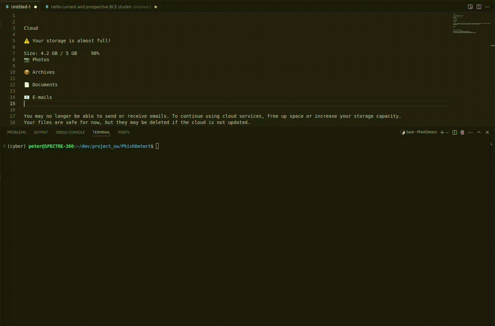

# Phishing Detection

This project utilizes the Gated Recurrent Unit, Long Short-Term Memory, Multi-Layer Perceptron, and Transformer Encoder models to detect phishing emails.

## Installation

Navigate to the project directory and install the package in editable mode
```bash
cd /PhishDetect
pip install -e .
```

Alternatively, if you prefer to work with local imports:

```bash
pip install yacs einops torch numpy pandas scikit-learn transformers
```

### Optional Packages

Although not necessary, Weights and Biases (wandb) is a good tool for tracking training progress:
```bash
pip install wandb
wandb login
```

## Usage

After installing the codebase as a package, you can now use PhishDetect anywhere:

```python
import PhishDetect.utils.arguments as args
import PhishDetect.models
import PhishDetect.datasets
```

### Running the Models

**Training:**
   ```bash
   python main.py --cfg settings/config_files/MODEL_TYPE.yaml --opts EXECUTION.MODE train
   ```

"train.sh" also provides the functionality of training all four model types at once.

**Demo:**
   ```bash
   python main.py --cfg settings/config_files/MODEL_TYPE.yaml --opts EXECUTION.MODE demo
   ```

